<div align="center">

# OpenRemoteGUI

### Vendor-neutral, browser-based remote GUI for Debian and Raspberry Pi

**Clone. Install. Open the browser. Control the desktop.**
No vendor cloud. No proprietary client. No account. No lock-in.

[](https://github.com/855princekumar/OpenRemoteGUI/actions/workflows/ci.yml)
[](https://github.com/855princekumar/OpenRemoteGUI/actions/workflows/shellcheck.yml)
[](https://github.com/855princekumar/OpenRemoteGUI/releases)
[](LICENSE)
[](#supported-platforms)
[](#hardware-support)
[](#)
[](#how-it-works)

</div>

<p align="center">
  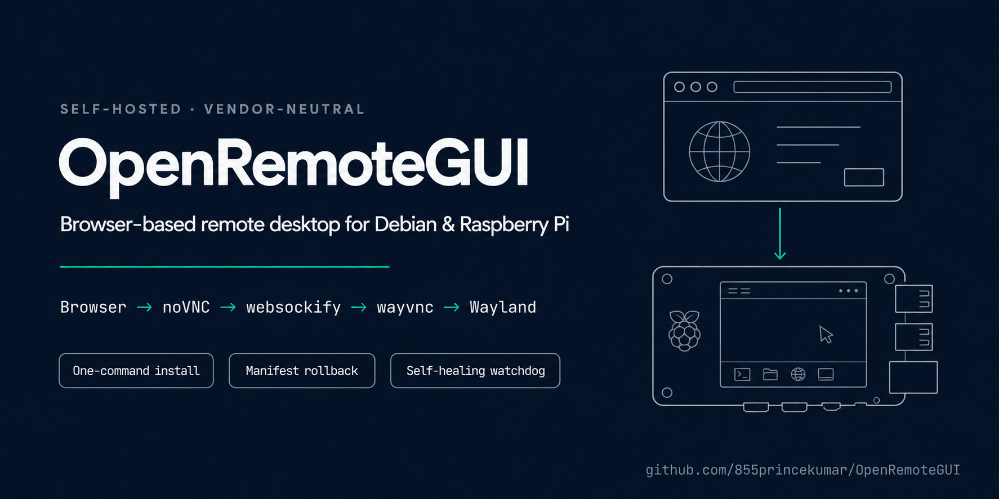
</p>

<p align="center">
  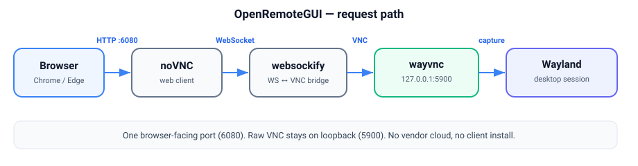
</p>

```text
Git Clone  ──▶  sudo ./install.sh  ──▶  http://NODE-IP:6080  ──▶  Full Linux Desktop
```

> [!NOTE]
> OpenRemoteGUI is the **deployment and lifecycle layer** around a browser VNC stack
> (noVNC + websockify + wayvnc). Its value is the one-command install, the
> manifest-driven rollback, the self-healing watchdog, and the fleet-friendly design,
> not the VNC transport itself.

> [!IMPORTANT]
> **Network scope for v1.0.0.** This release is designed, tested, and validated for use
> on **trusted LAN and VPN (e.g. WireGuard/Tailscale) networks only**. It is **not**
> intended for direct exposure on the public internet, and its security guarantees are
> limited to that private-network context. A dedicated **public-route mode** (TLS
> reverse proxy + authentication, with port-forwarding guidance) is planned for an
> upcoming release. See [Network Scope & Roadmap](#network-scope) and [`SECURITY.md`](SECURITY.md).

---

## Contents

- [Overview](#overview)
- [Why OpenRemoteGUI](#why-openremotegui)
- [Features](#features)
- [Architecture](#architecture)
- [How It Works](#how-it-works)
- [Supported Platforms](#supported-platforms)
- [Quick Start](#quick-start)
- [Installation](#installation)
- [Browser Access](#browser-access)
- [Security Model](#security-model)
- [Service Architecture](#service-architecture)
- [Watchdog & Self-Healing](#watchdog--self-healing)
- [Manifest & Restore Point](#manifest--restore-point)
- [Rollback](#rollback)
- [Updates](#updates)
- [Fleet Deployment](#fleet-deployment)
- [Configuration](#configuration)
- [Hardware Support](#hardware-support)
- [Architecture Decision Records](#architecture-decision-records)
- [Operational Workflow](#operational-workflow)
- [Troubleshooting](#troubleshooting)
- [Development & Testing](#development--testing)
- [Release Process](#release-process)
- [Roadmap](#roadmap)
- [Contributing](#contributing)
- [Security Policy](#security-policy)
- [License](#license)

---

## Overview

OpenRemoteGUI exposes an **existing** Linux Wayland desktop session through a browser,
over your own LAN or VPN. You get the real desktop (mouse, keyboard, applications) at
`http://NODE-IP:6080` without installing a vendor agent or signing into a cloud service.

It is intentionally small on the edge node:

```text
Raspberry Pi OS Lite / Debian
├── Wayland session (already present)
├── wayvnc        (captures the session, loopback only)
├── noVNC         (browser client, served locally)
├── websockify    (WebSocket ⇄ VNC bridge)
└── OpenRemoteGUI (installer · systemd units · watchdog · rollback)
```

## Why OpenRemoteGUI

| You want | OpenRemoteGUI gives you |
| --- | --- |
| Browser desktop over your VPN | `http://NODE:6080`, no client install |
| No vendor cloud / no account | Fully self-hosted, offline-capable |
| Reversible changes on production nodes | Manifest-driven rollback, restores originals |
| Fleet rollout | Idempotent installer, Ansible-friendly, one command |
| Not to nuke headless servers | Refuses to install a desktop; fails safe with no changes |
| Auditability | Every mutation recorded; install/rollback logs kept |

## Features

- **One-command install** - `git clone` → `sudo ./install.sh` → browser.
- **Loopback-only VNC** - raw VNC (`5900`) is never bound to the network; only the
  gateway (`6080`) is reachable.
- **Manifest-driven rollback** - removes/restores *exactly* what was installed; no
  blanket `apt remove` or `rm -rf`.
- **Self-healing watchdog** - restarts only OpenRemoteGUI units, backs off on headless
  nodes instead of thrashing.
- **Hardware-aware** - Pi Zero/3 (lightweight) · Pi 4 (standard) · Pi 5 (GPU) · generic Debian.
- **Fails safe** - no Wayland session and no compositor? It makes **no changes** and tells you why.
- **Isolated footprint** - everything under `/opt/openremotegui`, `/etc/openremotegui`,
  `/var/lib/openremotegui`; private Python virtualenv for websockify.
- **Auto-rollback on failed install** - a broken install reverts itself.

## Architecture

OpenRemoteGUI is a thin chain of well-scoped layers. The **browser** loads the **noVNC**
web client; **websockify** bridges that browser WebSocket to a TCP VNC stream; **wayvnc**
captures the live **Wayland** desktop and answers on loopback only. The lifecycle layer
(installer, rollback, watchdog) wraps this so a single command brings it up and a single
command tears it down.

<p align="center">
  
</p>

High-level data path (GitHub renders this Mermaid natively):

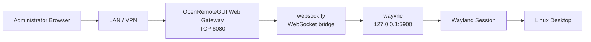

**Reading it:** the administrator reaches the node only through the LAN/VPN and only over
port 6080. Everything to the right of the gateway lives on the node itself; the VNC hop is
bound to `127.0.0.1`, so the raw protocol is never visible on the network.

Security boundary - the browser talks to `6080`; raw VNC stays on loopback:

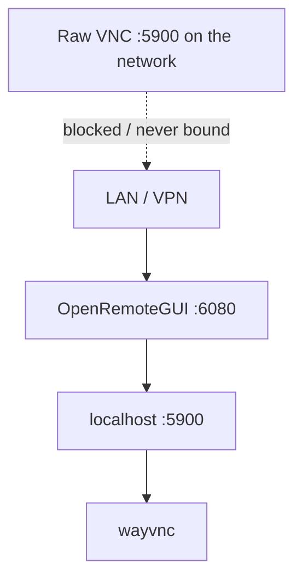

**Reading it:** there is exactly one path in (6080) and one trust boundary (the network).
The dotted line is the path that does **not** exist: raw VNC is never bound to a routable
address, so it cannot be reached from the LAN even by mistake.

## How It Works

Boot and connect sequence:

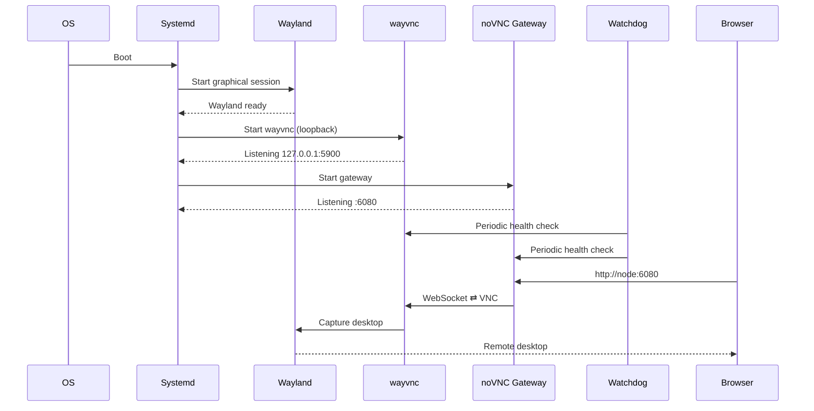

**Reading it:** at boot the desktop session comes up first, then wayvnc attaches to it and
listens on loopback, then the gateway starts. The watchdog probes both continuously. When
you open the URL, the gateway upgrades your request to a WebSocket and pipes it to wayvnc,
which streams the live desktop back.

`wayvnc` attaches to a running **wlroots-based** Wayland compositor (labwc, Wayfire,
sway, ...) and can operate without a physical monitor. OpenRemoteGUI never starts a
desktop of its own - the session must already exist.

## Supported Platforms

Debian-family systems (`ID`/`ID_LIKE` of `debian`, `raspbian`, or `ubuntu`) **with an
existing Wayland graphical session**. A headless server has no desktop to capture, and
the installer will not create one.

## Quick Start

```bash
git clone https://github.com/855princekumar/OpenRemoteGUI.git
cd OpenRemoteGUI
sudo ./install.sh
```

Then open:

```text
http://NODE-IP:6080/
```

The root URL redirects to the noVNC console (`/vnc.html`).

> [!TIP]
> If the installer cannot auto-detect the desktop user, pass it explicitly:
> `sudo ORGUI_USER=pi ./install.sh`

## Installation

The installer performs a strict, ordered, fully-recorded sequence:

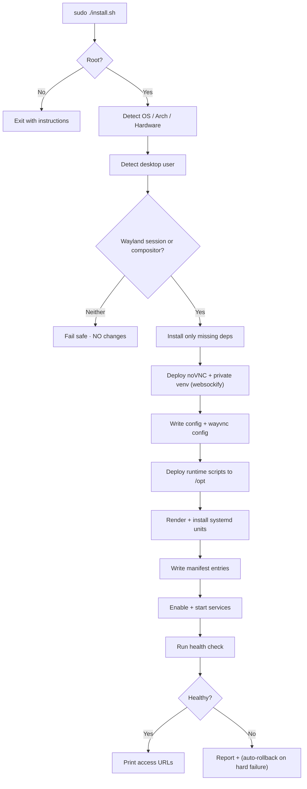

**Reading it:** the installer refuses to touch a node with no Wayland session, records every change as it goes, verifies health at the end, and reverts itself if a step fails - so a half-finished install never lingers.

Environment overrides:

| Variable | Default | Purpose |
| --- | --- | --- |
| `ORGUI_USER` | auto-detect | Desktop user whose session is captured |
| `ORGUI_OWNER` | `855princekumar` | GitHub owner used in unit `Documentation=` |
| `ORGUI_GATEWAY_USER` | `root` | User that runs the noVNC gateway |
| `NOVNC_REF` | `master` | noVNC git ref to check out |
| `ORGUI_AUTO_ROLLBACK` | `1` | Revert automatically if install fails |
| `ORGUI_FORCE` | `0` | Proceed even if no compositor is detected |
| `ORGUI_NO_PROMPT` / `ORGUI_ASSUME_YES` | unset | Never show the version-selection prompt (set automatically on non-TTY/fleet runs) |

### On-node commands & version selection

`install.sh` copies the management scripts to `/opt/openremotegui/.self/` and installs
three commands, so you can manage a node without keeping the git clone:

```bash
sudo openremotegui-rollback     # roll back the current version (auto-archives it)
sudo openremotegui-restore      # list / reinstall an archived version
sudo openremotegui-install      # reinstall the current version
```

If archived versions already exist and you run the installer **interactively**, it
offers to reinstall one of them instead of the cloned version:

```text
Previously archived version(s) found on this node:
   1) v1.0.0-20260820-120000   (version 1.0.0, ...)
   0) install this cloned version (1.1.0) [default]

Select a version to install [0-1]:
```

On non-interactive/fleet runs (no TTY, or `ORGUI_NO_PROMPT=1`) it never prompts and
installs the cloned version.

## Browser Access

```text
LAN:  http://192.168.x.x:6080/
VPN:  http://10.x.x.x:6080/
SSH:  ssh user@node          (independent, unchanged)
Raw VNC (5900): NOT EXPOSED  (loopback only)
```

## Security Model

<p align="center">
  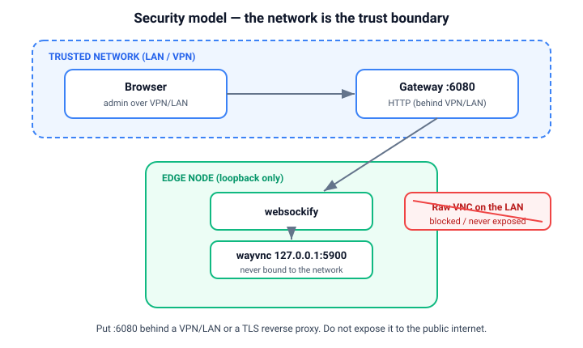
</p>

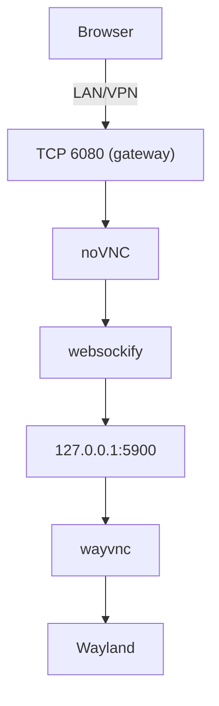

**Reading it:** authentication and encryption are expected to come from the layer you
already trust - the VPN or LAN, or a TLS reverse proxy you place in front of 6080. Inside
the node the chain is loopback-only, so compromising the transport requires already being
on the trusted network.

Principles:

- **No vendor cloud** and **no outbound control plane** are required.
- **Raw VNC is never bound to the network** - it lives on `127.0.0.1:5900`.
- The **network is the trust boundary**: deploy `6080` behind a VPN/LAN or a TLS
  reverse proxy.
- SSH remains fully independent and untouched.
- systemd hardening is applied to both units (`ProtectSystem=strict`,
  `NoNewPrivileges`, `PrivateTmp`, restricted read/write paths).

> [!IMPORTANT]
> OpenRemoteGUI does not provide network-layer security by itself. Put TCP/6080 behind
> a trusted VPN/LAN or a reverse proxy that terminates TLS and authentication. See
> [`SECURITY.md`](SECURITY.md) and [ADR-0005](docs/adr/ADR-0005-localhost-vnc-binding.md) /
> [ADR-0010](docs/adr/ADR-0010-authentication-default.md).

## Gateway Authentication

By default (`GATEWAY_AUTH=1`) the installer puts a minimal **nginx** reverse proxy in
front of the gateway that enforces **HTTP Basic Auth**, and moves websockify to loopback
`:6081`. You get a real browser username/password prompt protecting both the page and the
desktop stream.

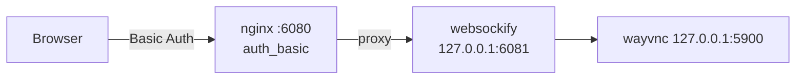

**Reading it:** nginx challenges the browser on the page request; once you log in, the
browser reuses the same credentials on the WebSocket, so the whole session is gated by one
prompt. websockify never faces the network directly.

Setting credentials:

```bash
# Interactive: the installer prompts for username + password
sudo ./install.sh

# Non-interactive / fleet: pass credentials
sudo ORGUI_AUTH_USER=admin ORGUI_AUTH_PASS='choose-a-strong-one' ./install.sh

# Disable auth entirely (rely on VPN/LAN only)
sudo ORGUI_GATEWAY_AUTH=0 ./install.sh
```

Credentials are stored as an apr1 hash in `/etc/openremotegui/gateway.htpasswd`. To change
them later, edit that file with `openssl passwd -apr1` or reinstall.

> [!WARNING]
> Basic Auth over plain HTTP sends the password **base64-encoded, not encrypted**. It is a
> baseline to keep casual and accidental access out on a trusted VPN/LAN, not protection
> against network sniffing. For real confidentiality, front the node with a TLS-terminating
> reverse proxy (planned public-route mode). See ADR-0013.

## Service Architecture

All three run as systemd **user** services for the desktop user (enabled with
`loginctl enable-linger` so they start at boot). This attaches wayvnc to the real
Wayland session and avoids the system `graphical.target` ordering cycle. See ADR-0012.

| Unit (user) | Type | Purpose |
| --- | --- | --- |
| `openremotegui-wayvnc.service` | simple | Captures Wayland → `127.0.0.1:5900` (loopback) |
| `openremotegui-novnc.service` | simple | noVNC + websockify on `:6080` |
| `openremotegui-watchdog.service` | oneshot | One health/heal pass |
| `openremotegui-watchdog.timer` | timer | Fires the watchdog every 30s |

Manage and inspect with the user manager:

```bash
systemctl --user status openremotegui-wayvnc openremotegui-novnc
journalctl --user -u openremotegui-wayvnc -u openremotegui-novnc -n 100 --no-pager
```

## Watchdog & Self-Healing

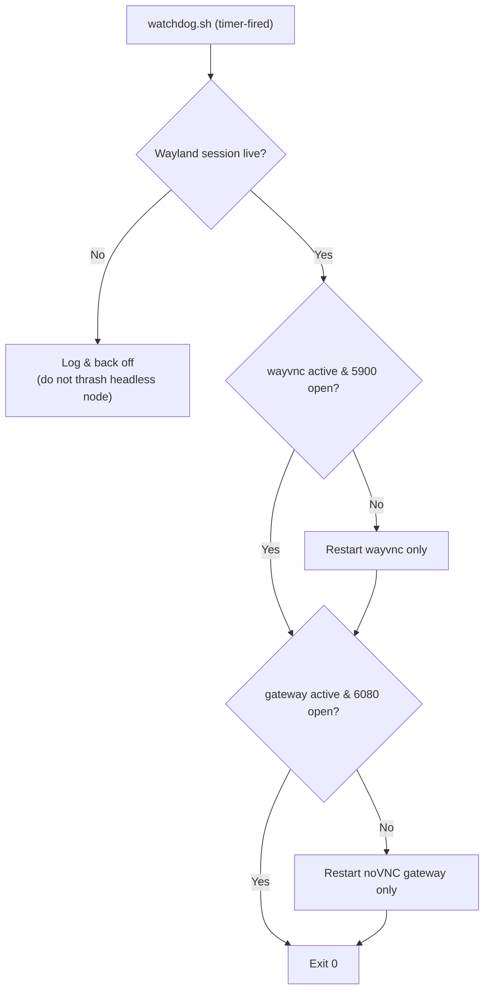

The watchdog **never touches unrelated services** and treats a missing desktop session
as a condition to wait on, not to fight.

## Manifest & Restore Point

Every mutating action is appended to `/var/lib/openremotegui/install-manifest`:

```text
META|VERSION=1.0.0
PACKAGE|wayvnc
DIR|/opt/openremotegui/noVNC
DIR|/opt/openremotegui/venv
FILE|/etc/openremotegui/openremotegui.conf
FILE|/etc/systemd/user/openremotegui-wayvnc.service
LINGER|pi
ENABLED_USER|openremotegui-wayvnc.service
```

Backups of any overwritten file are stored under `/var/lib/openremotegui/backups/`.

## Rollback

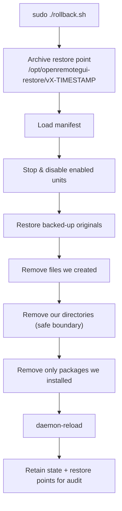

**Reading it:** rollback is driven entirely by the manifest, so it removes exactly what was installed, restores anything it overwrote, and leaves unrelated packages and files alone.

> **Rollback is manifest-driven, not pattern-driven.** It restores originals it backed
> up, deletes only what it created, and removes only packages that were absent before
> install. It refuses to delete directories outside `/opt/openremotegui`.

```bash
sudo ./rollback.sh
```

### Restore Points

<p align="center">
  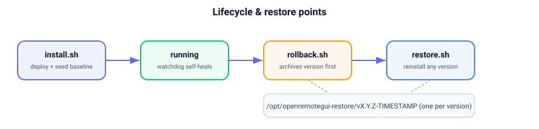
</p>

Every rollback first **archives the version it is removing** as a lightweight restore
point under `/opt/openremotegui-restore/vX.Y.Z-TIMESTAMP/`. In addition, **`install.sh`
seeds a baseline restore point** for the version it deploys and **archives the previous
version on upgrade**, so a stable point exists from the first install onward (one folder
per version). Only the scripts are stored (noVNC/venv are re-fetched on install), so each
point is a few tens of KB and keeping several on a node is cheap. This lets you move
between versions and reinstall whichever one feels stable.

```bash
# List archived versions on this node
./restore.sh

# Reinstall a specific version
sudo ./restore.sh v1.0.0-20260820-120000
```

Restore points are **not** deleted by rollback or by purging state; remove them yourself
when you no longer need them:

```bash
sudo rm -rf /opt/openremotegui-restore/<name>
```

Typical version-swap flow:

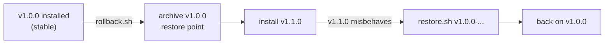

## Updates

```bash
sudo ./update.sh
```

Refreshes noVNC and websockify, redeploys the runtime scripts, restarts the services,
and verifies health (failing loudly if the post-update check does not pass).

## Fleet Deployment

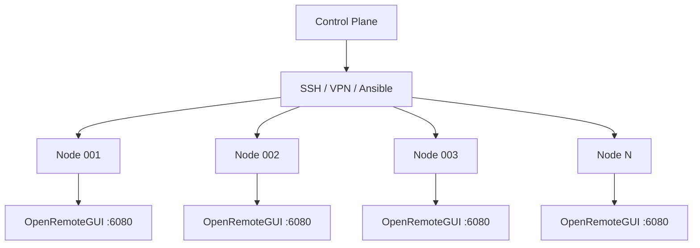

**Reading it:** the control plane only ever needs `http://NODE:6080` per node; it never has to understand VNC, and each node is installed and rolled back independently.

Ansible example:

```bash
# Ship and run the installer across the fleet
ansible all -m copy -a "src=./ dest=/opt/src/OpenRemoteGUI mode=0755"
ansible all -b -m shell -a "cd /opt/src/OpenRemoteGUI && ORGUI_NO_PROMPT=1 ./install.sh"

# Roll back the fleet
ansible all -b -m shell -a "cd /opt/src/OpenRemoteGUI && ./rollback.sh"
```

Your control plane only needs `http://NODE:6080` - it never has to understand VNC.

> [!IMPORTANT]
> Before a large rollout, run the [Fleet Pilot Checklist](docs/operations/fleet-pilot.md)
> on one Pi 3, one Pi 4, and one Pi 5 (each booted to a Wayland desktop). End-to-end
> capture and reboot resilience cannot be proven in CI and must be validated on
> hardware first. Nodes running Pi OS **Lite** have no desktop and are refused by design.

## Configuration

Live config: `/etc/openremotegui/openremotegui.conf` (template:
[`config/openremotegui.conf.example`](config/openremotegui.conf.example)).

| Key | Default | Meaning |
| --- | --- | --- |
| `HTTP_PORT` | `6080` | Browser gateway port |
| `VNC_HOST` | `127.0.0.1` | VNC bind address (keep loopback) |
| `VNC_PORT` | `5900` | VNC port |
| `WAYVNC_USER` / `WAYVNC_UID` | detected | Desktop session owner |
| `NOVNC_DIR` / `NOVNC_VENV` | under `/opt` | Install locations |
| `ENABLE_VNC_AUTH` | `0` | Opt-in VNC-layer auth (see ADR-0010) |

## Hardware Support

| Platform | Arch | Wayland | GUI suitability | Mode |
| --- | --- | --- | --- | --- |
| Pi Zero / Zero 2 W | ARM/ARM64 | session-dependent | Limited/Moderate | lightweight |
| Pi 3 | ARM64 | Yes | Good | lightweight |
| Pi 4 | ARM64 | Yes | Very good | standard |
| Pi 5 | ARM64 | Yes | Excellent | gpu |
| Debian PC | x86_64 | session-dependent | Excellent | standard |
| Debian server | x86_64 | usually none | N/A | requires a GUI session |

> Installing on a headless server does **not** create a desktop; the installer reports
> the missing session and makes no changes.

## Architecture Decision Records

Full records live in [`docs/adr/`](docs/adr/). Index:

| ADR | Decision | Status |
| --- | --- | --- |
| [0001](docs/adr/ADR-0001-record-architecture-decisions.md) | Record architecture decisions | Accepted |
| [0002](docs/adr/ADR-0002-wayland-over-x11.md) | Target Wayland rather than X11 | Accepted |
| [0003](docs/adr/ADR-0003-wayvnc-as-vnc-server.md) | Use wayvnc as the VNC server | Accepted |
| [0004](docs/adr/ADR-0004-novnc-browser-client.md) | Use noVNC + websockify as the browser client | Accepted |
| [0005](docs/adr/ADR-0005-localhost-vnc-binding.md) | Bind VNC to localhost, expose only the gateway | Accepted |
| [0006](docs/adr/ADR-0006-systemd-service-management.md) | Manage services with systemd | Accepted |
| [0007](docs/adr/ADR-0007-manifest-driven-rollback.md) | Manifest-driven rollback | Accepted |
| [0008](docs/adr/ADR-0008-no-desktop-installation.md) | Never install a desktop environment | Accepted |
| [0009](docs/adr/ADR-0009-vendor-neutral-networking.md) | Vendor-neutral networking (BYO VPN) | Accepted |
| [0010](docs/adr/ADR-0010-authentication-default.md) | Authentication default & trust boundary | Accepted |
| [0011](docs/adr/ADR-0011-rpi-connect-coexistence.md) | Coexistence with Raspberry Pi Connect | Accepted |
| [0012](docs/adr/ADR-0012-user-service-session-model.md) | Capture as systemd user services with linger | Accepted |
| [0013](docs/adr/ADR-0013-gateway-basic-auth.md) | Baseline gateway Basic Auth via nginx | Accepted |

## Operational Workflow

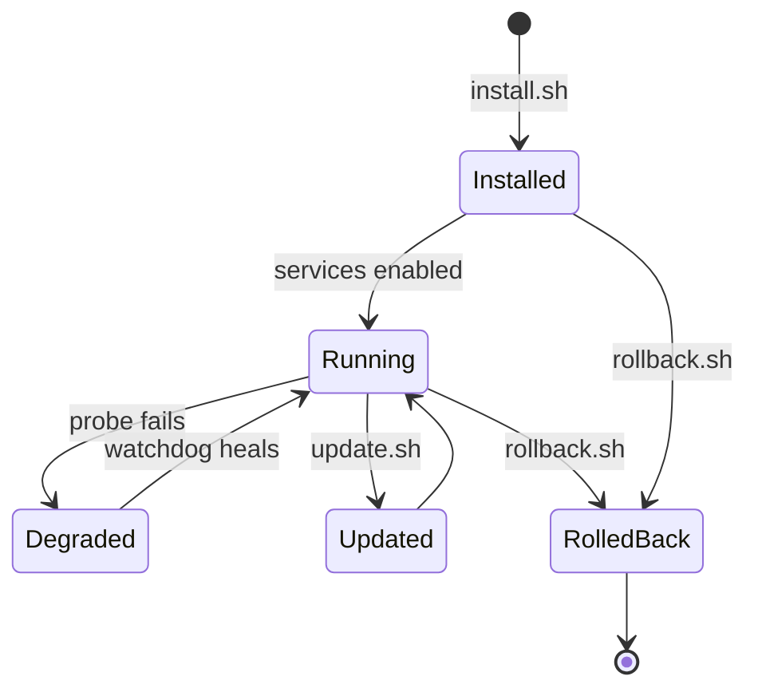

**Reading it:** a node moves between these states through the three verbs (install, update, rollback) plus automatic watchdog healing; every transition is reversible via a restore point.

## Troubleshooting

| Symptom | Likely cause | Action |
| --- | --- | --- |
| `Unsupported security types (types: 262)` in browser console | Gateway is pointed at Raspberry Pi Connect's wayvnc (RSA-AES only), not ours | Reinstall (this build disables rpi-connect screen sharing and runs its own wayvnc), or run `rpi-connect vnc off` |
| `noVNC requires a secure context (TLS)` warning | Encrypted VNC auth needs WebCrypto, unavailable over plain HTTP | Expected on HTTP; our wayvnc uses security type `None`, so it still works behind a VPN/LAN |
| wayvnc exits with `Failed to bind` / SIGSEGV | VNC port already held by another VNC server | This build pre-flights and auto-selects a free port; check `sudo ss -ltnp \| grep 5900` |
| Boot log: `Found ordering cycle on graphical.target` | 1.0.0 system-unit cycle | Handled by this build (user services) |
| Health check "NOT READY" | No live Wayland session yet | Log in to the desktop / reboot; `systemctl --user status openremotegui-wayvnc` |
| `:6080` refuses connection | Gateway not running | `journalctl --user -u openremotegui-novnc -n 100 --no-pager` |
| Black screen in browser | wayvnc not attached / no display output | Confirm a wlroots compositor is running; on headless nodes attach an HDMI dummy or force a KMS mode |
| Wrong desktop user detected | Multiple accounts | Reinstall with `ORGUI_USER=<name>` |
| Browser keeps asking for password | Wrong credentials, or htpasswd unreadable by nginx | Check `/etc/openremotegui/gateway.htpasswd`; reinstall or update the hash with `openssl passwd -apr1` |
| Want no login prompt | Auth is on by default | Reinstall with `ORGUI_GATEWAY_AUTH=0` |

## Development & Testing

```bash
# Lint every shell script (CI enforces this)
shellcheck -x install.sh rollback.sh update.sh scripts/*.sh lib/common.sh

# Syntax-only pass
bash -n install.sh rollback.sh update.sh scripts/*.sh

# Local test harness
tests/run.sh
```

## Release Process

```bash
git tag -a v1.0.1 -m "OpenRemoteGUI v1.0.1"
git push origin v1.0.1
```

Then create the GitHub Release from the `v1.0.1` tag and attach the packaged archive.
See [`CHANGELOG.md`](CHANGELOG.md).

## Network Scope

**v1.0.0 is validated for trusted LAN and VPN networks only.**

| Scenario | Supported in v1.0.0 | Notes |
| --- | --- | --- |
| LAN (`http://192.168.x.x:6080`) | Yes | Tested and validated |
| VPN overlay (WireGuard / Tailscale) | Yes | Tested and validated; recommended for fleets |
| Direct public internet exposure | **No** | Out of scope; do not port-forward `:6080` to WAN |
| Public route via TLS reverse proxy | Planned | See below |

The security model of this build assumes the network itself is a trust boundary
(private LAN or VPN). On such networks the raw VNC port is never exposed and only the
local browser gateway is reachable. Outside that boundary, plain HTTP on `:6080` and
the default VNC-layer settings are **not** sufficient - so this release deliberately
does not target the public internet.

### Planned: public-route mode (future release)

A dedicated public-access path is on the roadmap and is **not** part of this build:

- A **reverse-proxy mode** (nginx/Caddy) terminating **TLS** and enforcing
  authentication in front of the gateway.
- Documented **port-forwarding** guidance for internet-facing deployments.
- First-class wayvnc RSA / username-password auth wiring (`ENABLE_VNC_AUTH=1`).

Until that ships, keep OpenRemoteGUI behind your LAN or VPN.

## Roadmap

- **Public-route mode**: TLS reverse proxy + authentication + port-forwarding guide
  (the dedicated internet-facing use case; see [Network Scope](#network-scope)).
- First-class wayvnc RSA/username-password auth wiring (`ENABLE_VNC_AUTH=1`).
- Prometheus-friendly health endpoint.
- Packaged `.deb` for `apt` installs.

## Contributing

See [`CONTRIBUTING.md`](CONTRIBUTING.md) and [`CODE_OF_CONDUCT.md`](CODE_OF_CONDUCT.md).
Issues and PRs are welcome; every shell change must pass ShellCheck in CI.

## Security Policy

Please report vulnerabilities privately per [`SECURITY.md`](SECURITY.md). Do not open
public issues for security reports.

## License

Released under the [MIT License](LICENSE).
